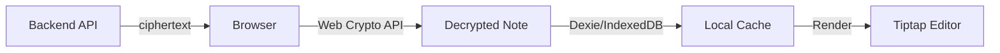
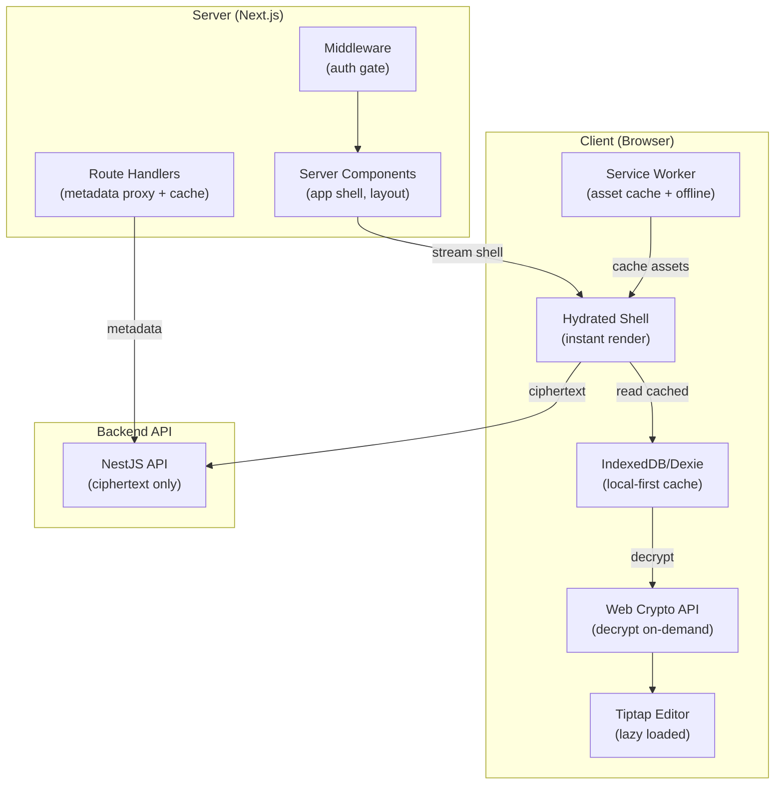

# Next.js Performance Optimisation for E2E Encrypted Apps

## Noteqo Architecture Overview

Noteqo's current data flow:



> [!IMPORTANT]
> **The E2E constraint**: The server never has access to plaintext. All decryption happens client-side via `Web Crypto API`. This fundamentally limits what SSR can do with *note content*, but it does NOT limit what SSR can do with the *app shell, layout, and non-sensitive data*.

---

## What Can vs Cannot Be Server-Rendered

| Layer | Server-Renderable? | Why |
|---|---|---|
| Root Layout, fonts, CSS | ✅ Yes | No encrypted data involved |
| Auth pages (login/register) | ✅ Yes | Public pages, no user data |
| App shell (sidebar skeleton, header) | ✅ Yes | Structural UI, no note content |
| Marketing / about / pricing pages | ✅ Yes | Static content |
| Space list (names, structure) | ❌ No | Space names are encrypted |
| Note list (titles, emojis) | ❌ No | Note titles are encrypted |
| Note content (editor) | ❌ No | Full content is encrypted |
| User's crypto keys | ❌ No | Stored in IndexedDB only |

---

## Optimisation Strategy — Tiered by Impact

### Tier 1: High Impact, Low Effort

#### 1. Server-Render the App Shell (Already Partially Done ✅)

Your [workspace layout](file:///Users/taranjeetsingh/Documents/dev/noteqo/frontend/app/(workspace)/layout.tsx) is already a Server Component composing `<AppShell>`, `<Sidebar>`, and `<Header>`. This is correct — the structural HTML ships in the initial response without any client JS.

**What to improve**: Ensure `<Sidebar>` and `<Header>` are server components at their root, with only the interactive leaves (note list, user menu) marked `'use client'`. Currently, if the entire Sidebar is a client component, the shell SSR benefit is partially lost.

```
Sidebar (Server Component — renders container + skeleton)
  └── SidebarNoteList (Client Component — decrypts & renders notes)
  └── SidebarNavTabs (Client Component — handles tab state)
```

#### 2. Static Pre-Rendering of Auth Pages

Your [auth layout](file:///Users/taranjeetsingh/Documents/dev/noteqo/frontend/app/(auth)/layout.tsx) and login/register pages contain zero encrypted data. These should be **fully static** (default Next.js behaviour if no dynamic data fetching).

**Verify**: Ensure these pages don't accidentally import client-side-only modules (like `dexie` or `crypto.service`) at the top level, which would force them into client bundles.

#### 3. `next/dynamic` for Heavy Client Components

The Tiptap editor is your heaviest client dependency (~200KB+ gzipped with all extensions). Currently it loads on every workspace page even if the user hasn't opened a note.

```tsx
// features/editor/components/NoteEditor/index.tsx
import dynamic from 'next/dynamic';
import { NoteEditorSkeleton } from './NoteEditorSkeleton';

export const NoteEditor = dynamic(
  () => import('./NoteEditor').then((mod) => mod.NoteEditor),
  {
    ssr: false,       // Cannot SSR — needs Web Crypto + IndexedDB
    loading: () => <NoteEditorSkeleton />,
  }
);
```

**Also consider lazy-loading**:
- `recharts` (only needed on dashboard/analytics if you add one)
- `cmdk` (only when search dialog opens)
- `react-day-picker` (only when date picker is used)

#### 4. Streaming with Suspense Boundaries

Even though note content can't be SSR'd, you can **stream the shell immediately** while client-side decryption happens:

```tsx
// app/(workspace)/notes/[noteId]/page.tsx
import { Suspense } from 'react';
import { NoteEditorSkeleton } from '@/features/editor';

export default function NotePage({ params }: { params: { noteId: string } }) {
  return (
    <Suspense fallback={<NoteEditorSkeleton />}>
      <NoteView noteId={params.noteId} />
    </Suspense>
  );
}
```

This sends the HTML shell *instantly* and streams the client component when ready — perceived performance improves dramatically.

---

### Tier 2: Medium Impact, Medium Effort

#### 5. Next.js Middleware for Auth Routing

Currently, `AuthGuard` does client-side auth checking via IndexedDB after the page loads, which means:
1. The workspace layout HTML ships
2. JS hydrates
3. `useAuthCheck` runs async IndexedDB query
4. If not authenticated, redirects client-side

**Improvement**: Use Next.js middleware + a lightweight session cookie (NOT the encryption keys — just an "is-logged-in" flag) to redirect unauthenticated users *before* any HTML is sent:

```tsx
// middleware.ts
import { NextResponse } from 'next/server';
import type { NextRequest } from 'next/server';

const PUBLIC_ROUTES = ['/login', '/register', '/'];

export function middleware(request: NextRequest) {
  const { pathname } = request.nextUrl;

  // Allow public routes
  if (PUBLIC_ROUTES.some((route) => pathname.startsWith(route))) {
    return NextResponse.next();
  }

  // Check for session cookie (set at login, HttpOnly)
  const session = request.cookies.get('noteqo-session');
  if (!session) {
    return NextResponse.redirect(new URL('/login', request.url));
  }

  return NextResponse.next();
}

export const config = {
  matcher: ['/((?!api|_next/static|_next/image|favicon.ico).*)'],
};
```

> [!NOTE]
> This does NOT replace the client-side `AuthGuard` (which verifies crypto keys exist in IndexedDB). It's a **fast first gate** that prevents loading the entire workspace bundle for unauthenticated users.

#### 6. Route Handler as API Proxy with Caching

Your [apiClient](file:///Users/taranjeetsingh/Documents/dev/noteqo/frontend/services/api.ts) calls the backend directly from the client. For **non-encrypted metadata** (e.g. user profile info, space membership lists — the server-side metadata that isn't encrypted), you can create Next.js Route Handlers that proxy and cache:

```tsx
// app/api/spaces/route.ts
import { NextResponse } from 'next/server';

export async function GET(request: Request) {
  const authHeader = request.headers.get('Authorization');

  const response = await fetch(`${process.env.BACKEND_URL}/spaces`, {
    headers: { Authorization: authHeader ?? '' },
    next: { revalidate: 60 },  // Cache for 60 seconds on server
  });

  const data = await response.json();
  return NextResponse.json(data, {
    headers: {
      'Cache-Control': 'private, s-maxage=60, stale-while-revalidate=120',
    },
  });
}
```

> [!WARNING]
> Only proxy **non-sensitive metadata** through Route Handlers. The encrypted ciphertext should still go directly client → backend to avoid unnecessary server hops. The server can't do anything useful with ciphertext anyway.

#### 7. Optimise the IndexedDB-First (Offline-First) Pattern

Your current flow in [useRemoteNotes](file:///Users/taranjeetsingh/Documents/dev/noteqo/frontend/features/workspace/hooks/useRemoteNotes.ts) does:

1. Fetch remote → decrypt → cache locally → render

**Better pattern**: Read local first, render immediately, then sync in background:

```tsx
// Proposed: useSpaceNotes with local-first pattern
export function useSpaceNotes(spaceId: string) {
  const [notes, setNotes] = useState<Note[]>([]);
  const [isLoading, setIsLoading] = useState(true);
  const [isSyncing, setIsSyncing] = useState(false);

  useEffect(() => {
    // Phase 1: Instant render from local cache
    const loadLocal = async () => {
      const cached = await noteService.getNotesForSpace(spaceId);
      setNotes(cached);
      setIsLoading(false);  // Show UI immediately with cached data
    };

    // Phase 2: Background sync with remote
    const syncRemote = async () => {
      setIsSyncing(true);
      try {
        // Fetch & decrypt remote notes...
        // Merge with local...
        // Update state with merged results...
      } finally {
        setIsSyncing(false);
      }
    };

    loadLocal().then(() => syncRemote());
  }, [spaceId]);

  return { notes, isLoading, isSyncing };
}
```

This gives **sub-100ms perceived load** for returning users since Dexie reads are nearly instant.

---

### Tier 3: Medium Impact, Higher Effort

#### 8. `next.config.ts` Optimisations

Your [next.config.ts](file:///Users/taranjeetsingh/Documents/dev/noteqo/frontend/next.config.ts) is currently empty. There are several zero-risk wins:

```tsx
import type { NextConfig } from "next";

const nextConfig: NextConfig = {
  // 1. Compress responses (Brotli in production)
  compress: true,

  // 2. Strict React mode for catching side-effect bugs
  reactStrictMode: true,

  // 3. Output standalone for Docker deployments
  // output: 'standalone',

  // 4. Tree-shake specific large packages
  modularizeImports: {
    'date-fns': {
      transform: 'date-fns/{{member}}',
    },
    '@hugeicons/core-free-icons': {
      transform: '@hugeicons/core-free-icons/{{member}}',
    },
  },

  // 5. Security headers
  async headers() {
    return [
      {
        source: '/(.*)',
        headers: [
          {
            key: 'X-Content-Type-Options',
            value: 'nosniff',
          },
          {
            key: 'X-Frame-Options',
            value: 'DENY',
          },
          {
            key: 'Referrer-Policy',
            value: 'strict-origin-when-cross-origin',
          },
        ],
      },
      {
        // Cache static assets aggressively
        source: '/_next/static/(.*)',
        headers: [
          {
            key: 'Cache-Control',
            value: 'public, max-age=31536000, immutable',
          },
        ],
      },
    ];
  },

  // 6. Experimental optimisations (Next.js 16)
  experimental: {
    optimizePackageImports: [
      '@tiptap/react',
      '@tiptap/starter-kit',
      '@tiptap/extensions',
      '@radix-ui/react-dropdown-menu',
      '@radix-ui/react-popover',
      'recharts',
      'date-fns',
    ],
  },
};

export default nextConfig;
```

#### 9. Prefetching & Parallel Data Loading

When a user navigates to a note, you currently:
1. Load the page component
2. Check auth
3. Fetch note from IndexedDB or API
4. Decrypt
5. Render

**Optimisation**: Use Next.js `<Link prefetch>` (default behaviour) to prefetch the route, and start decryption in parallel with navigation:

```tsx
// In sidebar note list — prefetch note data on hover
const handleNoteHover = useCallback((noteId: string) => {
  // Warm the IndexedDB cache / start decryption early
  noteService.getLocalNote(noteId).then((note) => {
    if (!note) {
      noteService.getRemoteNote(noteId);  // Start fetching in background
    }
  });
}, []);
```

#### 10. Service Worker for Offline + Cache Control

Since Noteqo already has an offline-first IndexedDB architecture, a Service Worker would complement this well:

- **Cache the app shell** (HTML, CSS, JS bundles) so the app loads instantly even offline
- **Background sync**: Queue API calls when offline, replay when online (your `syncQueueService` already does this at the application level, but a SW handles network-level retries)
- **Stale-while-revalidate** for API responses that carry encrypted data — serve cached ciphertext while refreshing in background

> [!TIP]
> Next.js doesn't have built-in SW support, but `next-pwa` or `@serwist/next` can be integrated. Given your existing sync queue, start with just static asset caching.

---

## Summary — Priority Action Items

| # | Action | Impact | Effort | Where |
|---|---|---|---|---|
| 1 | Split Sidebar into Server/Client layers | 🟢 High | Low | `components/layout/Sidebar/` |
| 2 | `next/dynamic` for Tiptap editor | 🟢 High | Low | `features/editor/` |
| 3 | Populate `next.config.ts` | 🟢 High | Low | [next.config.ts](file:///Users/taranjeetsingh/Documents/dev/noteqo/frontend/next.config.ts) |
| 4 | Suspense boundaries on note pages | 🟡 Medium | Low | `app/(workspace)/notes/` |
| 5 | Local-first data loading pattern | 🟢 High | Medium | `features/workspace/hooks/` |
| 6 | Middleware auth gate | 🟡 Medium | Medium | New `middleware.ts` |
| 7 | Route Handlers for metadata proxy | 🟡 Medium | Medium | `app/api/` |
| 8 | Prefetch notes on hover | 🟡 Medium | Low | Sidebar note list |
| 9 | Service Worker for static assets | 🟡 Medium | High | Root level |
| 10 | `modularizeImports` for tree-shaking | 🟢 High | Low | [next.config.ts](file:///Users/taranjeetsingh/Documents/dev/noteqo/frontend/next.config.ts) |

---

## What NOT to Do

> [!CAUTION]
> **Do NOT attempt to**:
> - Send encryption keys to the server for "server-side decryption" — this defeats E2E encryption entirely
> - Cache decrypted plaintext in Next.js server-side caches — the server must never see plaintext
> - Use Next.js `fetch` with `revalidate` for encrypted note content — the server can't process it meaningfully
> - Store JWT tokens in cookies for SSR data fetching of encrypted content — the decryption still needs client-side `Web Crypto API` which doesn't exist on the server

---

## Architecture After Optimisation



This architecture maximises what the server can do (shell, routing, metadata) while keeping all sensitive operations client-side where they belong.
